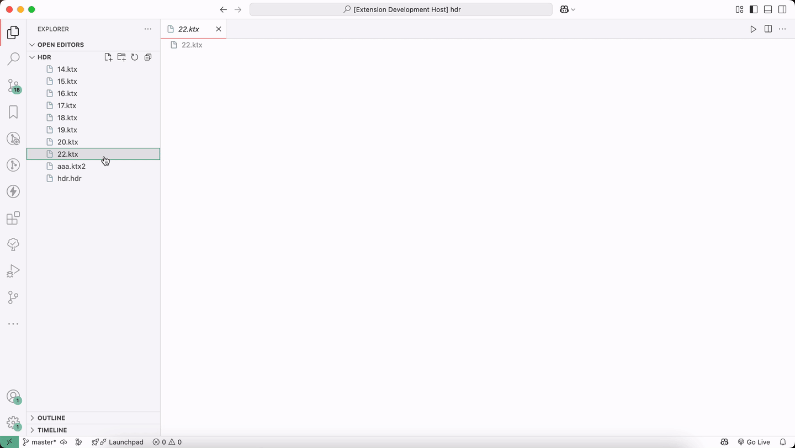

# KTX & HDR Viewer

A Visual Studio Code extension for previewing `.ktx`, `.ktx2`, and `.hdr` image files directly in the editor. Powered by [Three.js](https://threejs.org/).

## Features

- Supports viewing `.ktx`,`.ktx2` and `.hdr` files.
- Displays resolution and file size in the status bar.

### Screenshot

## Release Notes

### v0.0.1
- Initial release.

### v0.0.2
- Compatibility

## License

The [MIT License](LICENSE).
